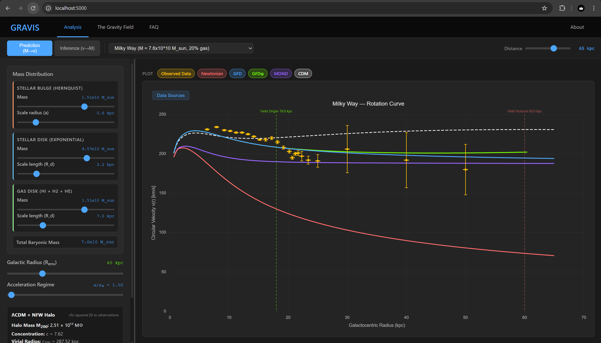

# GRAVIS: Gravity Field Dynamics Research Platform

A zero-parameter rotation curve prediction tool using **Gravity Field Dynamics**, implementing the **Dual Tetrad Gravity** (DTG) covariant completion.

Author: Stephen Nelson | Source: [github.com/fielddynamics/gravis](https://github.com/fielddynamics/gravis)

Supplemental tool for: Nelson, S. (2026). *Dual Tetrad Topology and the Field Origin: From Nuclear Decay to Galactic Dynamics*.



### The Covariant Completion

Given only the independently measured baryonic mass distribution of a galaxy, GRAVIS computes the full rotation curve with no dark matter and no free parameters. The core equation is the DTG covariant completion:

$$g(r) = \frac{1}{2}\left[g_N + \sqrt{g_N^2 + 4\,g_N\,a_0}\right]$$

where $g_N = GM(<r)/r^2$ is the Newtonian gravitational acceleration from baryons alone. This closed-form solution arises from the constitutive law $\mu(x) = x/(1+x)$, derived from topological closure of the dual tetrahedral metric. In the deep-MOND limit ($g_N \ll a_0$), it reduces to $g \approx \sqrt{g_N \, a_0}$; in the Newtonian limit ($g_N \gg a_0$), it recovers $g \approx g_N$.

The characteristic acceleration scale $a_0$ is derived from first principles:

$$a_0 = k^2 \, \frac{G \, m_e}{r_e^2} \approx 1.22 \times 10^{-10} \; \text{m/s}^2$$

where $k = 4$ is the simplex number for $d = 3$, $m_e$ is the electron mass, and $r_e$ is the classical electron radius. This matches the empirical MOND acceleration scale to within measurement uncertainty.

## What It Does

**Forward prediction (M -> v):** Supply a three-component baryonic mass model (Hernquist bulge + exponential stellar disk + exponential gas disk) and GRAVIS returns rotation curves under five frameworks:

- **Newtonian** -- standard $1/r^2$ gravity, baryons only
- **GFD (Dual Tetrad Gravity)** -- AQUAL field equation with $\mu(x) = x/(1+x)$, derived from topological closure
- **GFD\u03C6 (structural release)** -- GFD plus a gas-fraction-scaled structural term from stellated field origins, zero free parameters
- **Classical MOND** -- AQUAL field equation with $\mu(x) = x/\sqrt{1+x^2}$ (Bekenstein & Milgrom 1984)
- **CDM + NFW** -- abundance-matched dark matter halo with NFW profile

All five theories are rendered simultaneously on the same chart alongside published observational data with error bars, enabling direct visual comparison.

**Inverse inference (v -> M):** Given an observed circular velocity at a radius, infer the enclosed baryonic mass required by DTG. Multi-point consistency analysis propagates errors and computes deviation statistics across all observed radii.

## Interactive Exploration

GRAVIS is not just a static plotter. Every parameter is a live slider. Load any of the 10 pre-configured galaxies as a starting point, then adjust the mass distribution, scale lengths, galactic radius, and acceleration ratio in real time. All five theory curves update instantly.

**For researchers:** Test sensitivity to baryonic assumptions. What happens to the GFD prediction if the disk mass is 20% higher? If the gas scale length doubles? Toggle individual theories on and off to isolate their behavior.

**For educators and students:** The interactive sliders make this a powerful teaching tool:

- **Visual intuition** -- Watch how extending the gas disk's scale length lifts the outer rotation curve, or how increasing bulge mass steepens the inner rise. These relationships are hard to convey on paper but become immediate when you can drag a slider and see the response.
- **The mass discrepancy** -- Load any galaxy and compare the red Newtonian curve (baryons only, drops off) to the blue GFD curve (flat or rising). The gap between them is exactly what dark matter is invoked to explain.
- **Theory comparison** -- See where GFD, MOND, and CDM agree, where they diverge, and how each responds to the same baryonic input. No other tool shows all three side by side on real data.
- **From dwarfs to giants** -- Step through galaxies spanning 5 decades in mass: from DDO 154 (93% gas, 430 million solar masses) to UGC 2885 (250 billion solar masses). The same equation, with no parameter adjustments, handles them all.

## Quick Start

```bash
# Clone
git clone https://github.com/fielddynamics/gravis.git
cd gravis

# Install
pip install -r requirements.txt

# Run
python app.py
```

Open http://localhost:5000 in your browser.

## Project Structure

```
gravis/
  app.py                  Flask application entry point
  requirements.txt        Python dependencies
  physics/
    constants.py          CODATA 2022 / IAU 2015 physical constants
    mass_model.py         Distributed mass model (Hernquist + exponential)
    newtonian.py          Newtonian gravity: v_c = sqrt(G M(<r) / r)
    aqual.py              DTG solver: mu(x) = x/(1+x), AQUAL field equation
    equations.py          Unified equation library (GFD, GFDphi, MOND, CDM)
    engine.py             Multi-stage computation engine
    mond.py               Classical MOND solver: mu(x) = x/sqrt(1+x^2)
    nfw.py                NFW dark matter halo + abundance matching
    inference.py          Inverse problem: observed v -> inferred M
  api/
    routes.py             REST API endpoints
  data/
    galaxies.py           Galaxy catalog (10 galaxies, prediction + inference)
  templates/
    analysis.html         Main analysis interface
  static/
    css/gravis.css        Stylesheet
    js/gravis.js          Frontend logic (Chart.js)
  tests/                  400+ tests covering physics, API, and cross-galaxy validation
```

## Physics

### AQUAL Field Equation

Both DTG and classical MOND solve the same class of field equation:

$$\mu\!\left(\frac{|\nabla\Phi|}{a_0}\right) \nabla\Phi = \nabla\Phi_N$$

where $\Phi_N$ is the Newtonian potential. The two theories differ only in the constitutive law $\mu(x)$:

| Theory | Constitutive Law | Origin |
|--------|-----------------|--------|
| DTG | $\mu(x) = x/(1+x)$ | Topological closure of dual tetrahedron metric |
| MOND | $\mu(x) = x/\sqrt{1+x^2}$ | Empirical fit (Bekenstein & Milgrom 1984) |

Both admit closed-form solutions. DTG's function was independently identified as the empirically preferred form by Famaey & Binney (2005).

### Galaxy Mass Model

Each galaxy is decomposed into three independently measured baryonic components:

| Component | Profile | Parameters |
|-----------|---------|------------|
| Stellar bulge | Hernquist (1990) | Mass $M_b$, scale radius $a$ |
| Stellar disk | Exponential (Freeman 1970) | Mass $M_d$, scale length $R_d$ |
| Gas disk (HI + H2 + He) | Exponential | Mass $M_g$, scale length $R_g$ |

No dark matter halos are used anywhere. All mass parameters come from photometry, stellar population models, and 21 cm HI surveys.

### Included Galaxies

10 galaxies spanning 5 decades in baryonic mass, from giant spirals to gas-dominated dwarfs:

| Galaxy | $M_{\text{baryon}}$ | Gas Fraction | Sources |
|--------|---------------------|-------------|---------|
| UGC 2885 | $2.5 \times 10^{11}\;M_\odot$ | 40% | SPARC (Lelli+2016), Rubin+1980 |
| Andromeda (M31) | $1.2 \times 10^{11}\;M_\odot$ | 8% | Tamm+2012, Barmby+2006, Braun+2009 |
| Milky Way | $7.6 \times 10^{10}\;M_\odot$ | 20% | McMillan 2017, Bland-Hawthorn+2016, Kalberla+2009 |
| NGC 3198 | $3.4 \times 10^{10}\;M_\odot$ | 43% | SPARC (Lelli+2016), Begeman 1989 |
| NGC 2403 | $9.3 \times 10^{9}\;M_\odot$ | 42% | SPARC (Lelli+2016), Fraternali+2002 |
| NGC 6503 | $8.7 \times 10^{9}\;M_\odot$ | 27% | SPARC (Lelli+2016), de Blok+2008 |
| M33 | $7.1 \times 10^{9}\;M_\odot$ | 45% | Corbelli+2003, Corbelli+2014 |
| IC 2574 | $1.1 \times 10^{9}\;M_\odot$ | 92% | SPARC (Lelli+2016), Oh+2008 (THINGS) |
| NGC 3109 | $1.1 \times 10^{9}\;M_\odot$ | 91% | SPARC (Lelli+2016), Carignan+1989 |
| DDO 154 | $4.3 \times 10^{8}\;M_\odot$ | 93% | SPARC (Lelli+2016), Oh+2015 (LITTLE THINGS) |

All rotation curve data include 1-sigma error bars from published measurements. Mass parameters are independently measured from photometry and HI surveys, not fitted to the rotation curves.

## API

| Endpoint | Method | Description |
|----------|--------|-------------|
| `/api/galaxies` | GET | List all galaxies |
| `/api/galaxies/<id>` | GET | Get galaxy details |
| `/api/rotation-curve` | POST | Compute rotation curves |
| `/api/infer-mass` | POST | Infer mass from velocity |
| `/api/constants` | GET | Physical constants |

## Tests

```bash
pip install pytest
pytest tests/ -v
```

The test suite validates physical constants against CODATA/IAU values, checks solver accuracy, verifies round-trip consistency (M -> v -> M), and runs 30 cross-theory tests against the Milky Way.

## Citation

If you use GRAVIS in your research, please cite:

```bibtex
@software{nelson2026gravis,
  author  = {Nelson, Stephen},
  title   = {GRAVIS: Galactic Rotation from Field Dynamics},
  year    = {2026},
  url     = {https://github.com/fielddynamics/gravis}
}

@article{nelson2026dtg,
  author  = {Nelson, Stephen},
  title   = {Dual Tetrad Topology and the Field Origin:
             From Nuclear Decay to Galactic Dynamics},
  year    = {2026}
}
```

## License

[MIT](LICENSE)
